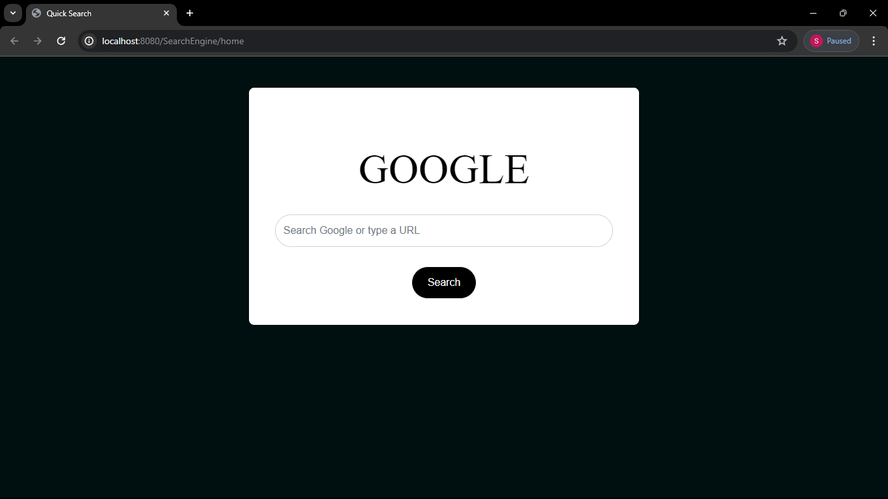

# QuickSearch 

## Description

QuickSearch is a simple search application built using RedirectView in Spring MVC. It allows users to quickly search for information and redirects them to the relevant pages based on their search query.

## Features

- Provides a fast and efficient way to search for information.
- Redirects users to the appropriate pages based on their search query.
- Simple and intuitive user interface.

## Screenshots

## Usage

1. Enter your search query in the search box.
2. Click the "Search" button.
3. You will be redirected to the relevant page based on your search query.

## Setup

1. Clone the repository to your local machine.
2. Import the project into your favorite IDE.
3. Build and run the project.
4. Access the application via your web browser.

## Contributing

Contributions are welcome! If you find any issues or have suggestions for improvements, please feel free to open an issue or create a pull request.

## Acknowledgements

- Thanks to [Spring Framework](https://spring.io/) for providing the tools and framework for building web applications.

